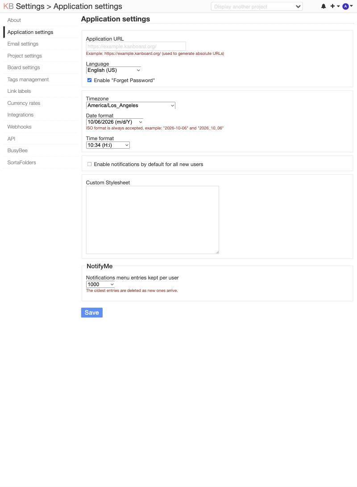

# NotifyMe

*NotifyMe* is a Kanboard plugin that sends email and Notifications menu notifications for your own actions (by default, Kanboard only notifies you about actions that others make). It also adds a vacation mode, notifies users of failed login attempts, and gives admins control of how many notifications are shown in the Notifications menu.


## Screenshot

*Settings -> Application settings -> NotifyMe* sets how many Notifications menu entries are kept per user.




## Quick start

1. Extract `NotifyMe.zip` to `/path/to/kanboard/plugins/NotifyMe/`.
2. Restart PHP-FPM or your web server if Kanboard's plugin cache doesn't pick up the new files.
3. Do something in a project like adding a comment. An email will arrive a moment later.

Enable the plugin and everyone gets their own notifications. Disable it and they stop.

[INSTALL.md](INSTALL.md) covers the requirements and compatibility.


## What NotifyMe sends notifications for

Email and Notifications menu entries:

- Task created, updated, closed, opened, or moved to a different column or swimlane
- Task assignee changed (including self-assignment)
- Subtask created, updated, or deleted
- Comment added, updated, or deleted
- File attached to or deleted from a task
- Task link created, updated, or deleted

Email only:

- File attached to or deleted from a project
- Failed login attempt using your username if your account is active (at most one email per hour to prevent email bombing)
- Wiki page created, updated, or deleted


## Failed logins

When someone fails to log in with an active account's username, that account's owner gets an email about it with their username and a prompt to change the password if it wasn't them. At most one goes out per account per hour to prevent email bombing. Kanboard's own lockout still limits the login attempts.


## Notifications menu limit

NotifyMe adds a "Notifications menu entries kept per user" setting to *Settings -> Application settings -> NotifyMe* with options for 100, 500, 1000, and Unlimited.

Kanboard doesn't trim a user's Notifications menu, and a busy account can collect thousands of unread entries until the notifications menu page runs out of memory and refuses to open. Select Unlimited to turn trimming off, or select 100, 500, or 1000 and click "Save" to trim older entries.

The default is the 1,000 most recent entries, so installing NotifyMe fixes a Notifications menu page that won't open.


## Vacation mode

Vacation mode pauses many (but not all) Kanboard emails to a user, which is especially helpful for users who have an out-of-office autoresponder when [Mailmagik](https://github.com/creecros/Mailmagik) is installed. Paused email types are tasks, subtasks, comments, file and link events, mentions, and overdue digests.

Failed login attempts, password resets, invitations, and NotifyMe's own Vacation mode on / off emails *do* get sent.

Vacation mode is controlled three ways:

1. A user turns it on for each project they belong to from their profile (in "Vacation mode" on their profile's sidebar) and a "Vacation mode is on" message is displayed.
2. A project manager turns it on for a member in their project (in "Vacation mode" on the project's sidebar) and a "Vacation mode is on" message is displayed.
3. Any login or browser visit with an already logged in browser turns Vacation mode off, shows a "Vacation mode turned off" message, and sends an email to the user and the project manager.

Email notifications are paused, but notifications in the Notifications menu still accumulate so the user sees what happened when they get back. Flags are stored in user metadata (`notifyme_vacation`, `notifyme_vacation_project_<id>`).

Vacation mode covers email notifications from Kanboard and other plugins (core, Mailmagik, or [TagAlong](https://github.com/christefano/TagAlong)) since NotifyMe replaces Kanboard's `userNotificationModel` and skips only the email type.

If Mailmagik is installed, out-of-office messages can create an endless loop: a user receives an email notification, an out-of-office message is sent back, Kanboard / Mailmagik gets an email notification about being out of the office, Kanboard sends an email notification about that, and so on. NotifyMe vacation mode fixes that.

Kanboard labels its emails `Auto-Submitted: auto-generated`, so compliant autoresponders should skip them.


## Limitations

- Notification menu entries requires that notifications have a title or target, so email-only events don't appear in the Notifications menu.
- Kanboard core doesn't have events for project create, update, and remove, category add and remove, and time-tracking entries, so none of these are currently supported.
- NotifyMe is currently English-only. Contributions are welcome! Please fork [NotifyMe](https://github.com/christefano/NotifyMe) on GitHub and create a pull request.


## Wiki plugin

If the [Wiki](https://github.com/funktechno/kanboard-plugin-wiki) plugin is installed, NotifyMe also emails you when you create, update, or delete a wiki page.


## Email footers

Every email NotifyMe sends has a "This is an automated notification from Kanboard." footer. If [NotKanboard](https://github.com/christefano/NotKanboard) is installed, NotifyMe uses NotKanboard's `footer_name` and `product_url` settings. Otherwise edit `plugins/NotifyMe/config.php`, for example:

```php
return array(
    'product_name' => 'NotKanboard',
    'product_url'  => 'https://notkanboard.org',
);
```

`product_url` is optional but requires `http` or `https`. Deleting or commenting out a key falls back to "Kanboard" with no link.

Reinstalling or updating the plugin can replace `config.php`. To keep your custom values through an update, put them in `NotifyMe.config.json` in Kanboard's `data/` directory (copy [`NotifyMe.config.json`](NotifyMe.config.json) from the plugin folder), for example:

```json
{"product_name": "NotKanboard", "product_url": "https://notkanboard.org"}
```


## Working with other plugins

Before each task email is sent, NotifyMe runs the `notifyme:email:subject` hook with an array holding `subject`, `task_id`, `project_name`, `task_title`, `event_name`, and `action` (the untranslated label, such as "New comment"). A listener can change `subject`. The TagAlong plugin uses it to apply its email subject format and append a reply-by-email token. With no listener the subject is unchanged, and a listener that throws is logged and skipped.

Before each email is sent, NotifyMe also runs `notifyme:email:reply_to` with a string a listener can set to a Reply-To address. TagAlong uses it so replies reach the reply-by-email mailbox. With no listener Reply-To is unchanged, and login alerts never run the hook.

Register a listener from any plugin's `initialize()`:

```php
$this->hook->on('notifyme:email:subject', function (&$data) {
    $data['subject'] .= ' [tag]';
});
```


## What it overrides

NotifyMe doesn't change any Kanboard core files or any other plugin's files, and it doesn't override any templates. It replaces or extends these at runtime:

| Part | Owner | How |
|---|---|---|
| `userNotificationModel` service | Kanboard | Subclass that skips the email type for a user in vacation mode and trims the Notifications menu after each notification. It skips whichever email type is registered, so it also covers Mailmagik's and TagAlong's |
| Settings, Application settings form | Kanboard | Adds the NotifyMe fieldset through the `template:config:application` hook |
| User and project sidebars | Kanboard | Add the Vacation mode links through `template:user:sidebar:actions` and `template:project:sidebar` |
| Footer name | NotKanboard, when installed | Reads its `footer_name` and `product_url` |

It also listens to Kanboard's task, subtask, comment, file, task link, project file, and login events, and to the Wiki plugin's `wikipage.*` events. Listening doesn't change what Kanboard or the other plugin does.


## Other plugins

NotifyMe works with other plugins from the same author:

- *NotKanboard* helps whitelabel Kanboard and replaces "Kanboard" in page titles, outgoing emails, and a few other places with your own product name. NotifyMe's footer uses that name.
- *TagAlong* supercharges Kanboard email support by filtering autoreplies, email signatures, and quoted text from incoming email, points Reply-To to the reply-by-email address, and adds a reply token to NotifyMe's and Kanboard's subjects, so replies become task comments through Mailmagik.


## Compatibility

- Kanboard >= 1.2.20
- NotifyMe doesn't make any schema changes. User metadata holds the failed login limit (`notifyme_auth_failure_at`) and the vacation flags. The settings table holds `notifyme_max_unread`.


## License

GNU General Public License v2. See LICENSE for details.
